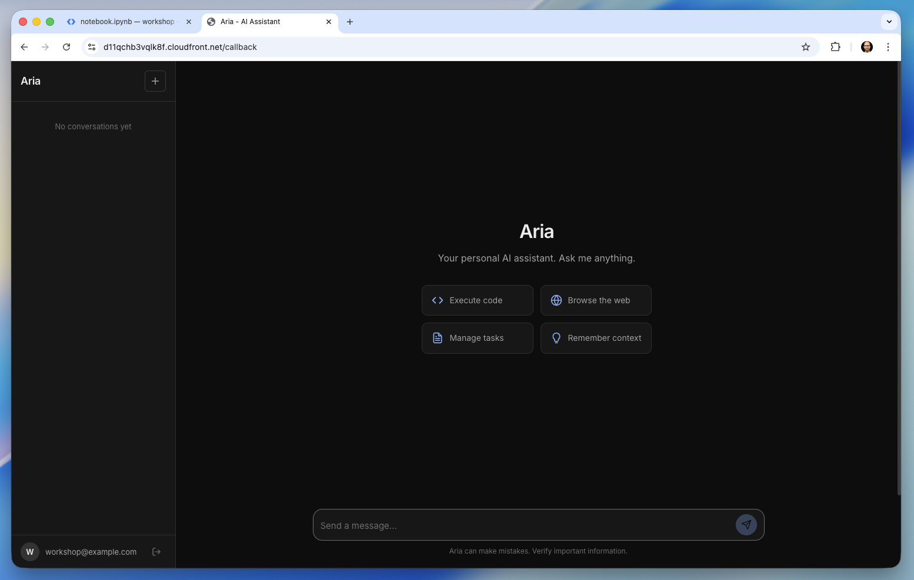
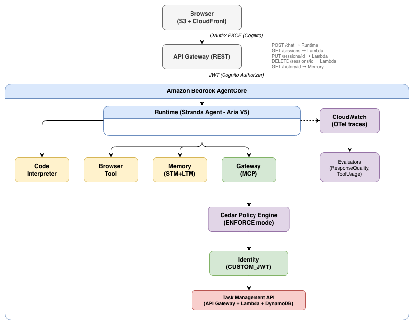

# 🚀 Curso Prático: Amazon Bedrock AgentCore

<p align="center">
  
  
  
  
</p>

Neste laboratório, você vai construir a **Aria**, uma assistente virtual com inteligência artificial pronta para o mundo real, usando os serviços do **Amazon Bedrock AgentCore**. No final deste curso, você terá criado do zero uma assistente hospedada na nuvem capaz de:

- Responder em tempo real (streaming)
- Lembrar de conversas passadas (memória de curto e longo prazo)
- Executar códigos em Python
- Navegar na web e consumir APIs
- Respeitar regras rígidas de segurança
- Gerar métricas e ser avaliada automaticamente

<p align="center">
  
</p>

---

## 🎯 O Que Você Vai Construir

**Aria** é uma assistente de IA pessoal e poderosa. Funcionalidades inclusas:

- 🔒 **Acesso Seguro:** Login via Amazon Cognito.
- ⚡ **Conversa Fluida:** Respostas rápidas e em tempo real usando streaming.
- 🐍 **Execução de Código:** Capacidade de rodar scripts em Python para cálculos, análise de dados ou geração de gráficos.
- 🌐 **Navegação Web:** Acesso à internet para buscar informações recentes e precisas.
- 📋 **Gestão de Tarefas:** Conexão com sua API de Gestão de Tarefas via Gateway do AgentCore.
- 🧠 **Memória Persistente:** Retenção de preferências e contexto de conversas passadas.

<p align="center">
  
</p>

---

## 📚 Módulos do Curso

O curso é **totalmente prático e incremental**. Cada módulo adiciona novas funcionalidades ao seu agente:

| Módulo | Título | O Que Você Vai Aprender |
|:------:|:-------|:------------------------|
| [**00**](00-prerequisites/) | **Pré-requisitos** | Como subir a infraestrutura base na AWS (Cognito, API Gateway, DynamoDB). |
| [**01**](01-introduction/) | **AgentCore CLI & Intro** | Arquitetura do AgentCore e fundamentos da linha de comando. |
| [**02**](02-runtime/) | **AgentCore Runtime** | Deploy do agente na nuvem com auto-scaling e streaming. |
| [**03**](03-tools/) | **AgentCore Tools** | Adição de ferramentas: Interpretador de Código (Python) e Navegador Web. |
| [**04**](04-memory/) | **AgentCore Memory** | Implementação de memória de curto e longo prazo para a Aria. |
| [**05**](05-gateway-identity/) | **Gateway & Identity** | Integração com APIs externas e proteção com autenticação JWT. |
| [**06**](06-policy/) | **AgentCore Policy** | Bloqueio de acessos indevidos e regras de negócio usando Cedar Policy. |
| [**07**](07-observability-evaluations/) | **Observabilidade** | Criação de dashboards, traces e avaliação de qualidade via LLMs. |
| [**08**](08-full-deployment/) | **Full Deployment** | Deploy da interface Web (Frontend) para ver todo o sistema em ação! |

### 🔄 Evolução do Agente

Ao longo dos módulos, nossa assistente evolui na nuvem:
- **V1 (Mód 02):** Chat básico usando modelos do Amazon Bedrock.
- **V2 (Mód 03):** `V1` + Interpretador de Código + Navegador Web.
- **V3 (Mód 04):** `V2` + Memória Persistente.
- **V4 (Mód 05):** `V3` + Conexão com Gateway + Repasse de token JWT.
- **V5 (Mód 07):** `V4` + Tratamento avançado de erros para produção.

---

## ⚙️ Pré-requisitos

### Ferramentas Necessárias
Para rodar este laboratório localmente, instale:
- **Python 3.12+**
- **Node.js 20+** e **npm**
- **AWS CLI v2** (Configurado com suas credenciais)
- **AWS CDK** (`npm install -g aws-cdk`)
- **AgentCore CLI** (`npm install -g @aws/agentcore`)
- **uv** (Gerenciador rápido de pacotes Python: `pip install uv`)
- **Docker** (Essencial para montar as imagens de deploy)
- **Jupyter** (`pip install jupyter ipykernel` - usaremos notebooks para o passo a passo)

### Permissões e Região da AWS
Certifique-se de executar o laboratório na região **`us-east-1`** para evitar problemas de disponibilidade. Sua conta precisará de permissões para:
> Amazon Bedrock, Amazon Cognito, API Gateway, DynamoDB, AWS Lambda, Amazon S3, AWS IAM, AWS CloudFormation, Amazon CloudWatch, AWS X-Ray, Amazon Verified Permissions, Amazon ECR.

---

## 🚀 Como Começar

### 1. Crie a Infraestrutura Base (CloudFormation)
O arquivo `infrastructure/prerequisites.yaml` contém a base do projeto (usuários, tabelas, APIs). Execute no terminal:

```bash
aws cloudformation deploy \
  --template-file infrastructure/prerequisites.yaml \
  --stack-name agentcore-workshop-prerequisites \
  --capabilities CAPABILITY_NAMED_IAM \
  --region us-east-1
```

> **⚠️ Atenção sobre o AWS X-Ray:** O script habilita o *X-Ray Transaction Search* por padrão, mas a AWS permite apenas um por conta/região. Se já estiver habilitado, adicione `--parameter-overrides EnableTransactionSearch=false` ao comando acima.

*(Aguarde cerca de 5 a 10 minutos para a conclusão)*

### 2. Prepare seu Ambiente Python
Crie um ambiente virtual e instale as dependências iniciais:

```bash
python3.12 -m venv .venv
source .venv/bin/activate  # No Windows use: .venv\Scripts\activate
pip install jupyter ipykernel boto3
python -m ipykernel install --user --name workshop --display-name "workshop"
```

### 3. Abra o Primeiro Notebook
Abra `00-prerequisites/notebook.ipynb` na sua IDE (VS Code, Jupyter, PyCharm). Selecione o kernel `workshop` que você acabou de criar e rode as células (`Shift+Enter`).

### 4. Siga os Módulos na Ordem
Os notebooks (00 ao 08) foram desenhados para execução sequencial. Eles incluem uma checagem `ensure_ready` para garantir que o módulo anterior foi concluído com sucesso.

### 5. Limpeza de Recursos (Fim do Curso)
Para evitar cobranças, lembre-se de limpar os recursos ao terminar. O Módulo 08 mostra o processo completo. Para apagar a infraestrutura base:

```bash
aws cloudformation delete-stack \
  --stack-name agentcore-workshop-prerequisites \
  --region us-east-1
```

---

## ⏱️ Estimativa de Tempo e Custo

- **⏳ Tempo:** 1 a 2 horas para concluir todos os módulos.
- **💰 Custo:** Aproximadamente $1 a $5 USD (a maior parte referente ao uso dos modelos do Amazon Bedrock).

---

> [!IMPORTANT]
> **Atribuição de Autoria e Compliance Institucional**
> 
> Todo o escopo, código base e arquitetura de infraestrutura gerada neste material de ensino derivam integralmente das fontes originais criadas pelo engenheiro de infraestrutura e autor da AWS, **Mike G. Chambers** (referência no GitHub: **[mikegc-aws](https://github.com/mikegc-aws)**). 
> 
> Este repositório é uma adaptação intensiva, traduzida e estruturada em formato de laboratório focado exclusivamente em ensino (hands-on) para o mercado brasileiro. Todos os direitos e créditos da arquitetura original pertencem e originam-se de seu trabalho. A finalidade deste repositório adaptado é educacional.
